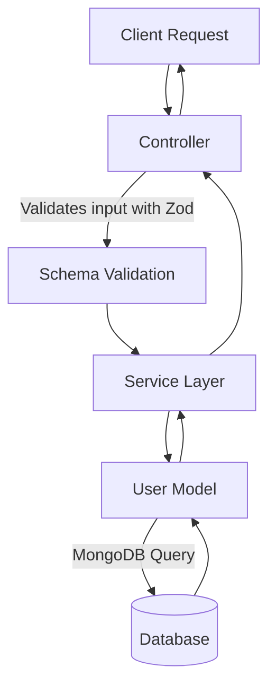

# User Module – Full Documentation

This document fully explains the **User Module** implementation with `model`, `service`, `controller`, `types`, and `validation schema`. Each part is broken down step by step for clarity and future reference.

---

## 1. **User Model** (`user.model.ts`)

### Purpose

Defines the **Mongoose schema** and **model** for `User`. Handles password hashing, instance methods, and JSON transformations.

### Key Features

- Fields: `name`, `email`, `password`, `role`, `status`
- Middleware: Password hashing before save
- Statics: `isUserExistsByEmail`, `isPasswordMatched`
- Transform: Hides sensitive fields when returning JSON

---

## 2. **User Types** (`user.types.ts`)

### Purpose

Defines TypeScript types/interfaces for **User data structures**, ensuring type safety across the project.

### Key Exports

- `IUser`: Main user interface (name, email, password, role, status)
- `IUserResponse`: Shape of response data returned to clients
- `CreateUserInput`, `UpdateUserInput`, etc.
- Role and status enums

---

## 3. **User Service** (`user.service.ts`)

### Purpose

Encapsulates **business logic** for user operations.

### Functions

- `createUser`: Creates new user in DB
- `getAllUsers`: Supports filtering, sorting, pagination
- `getUserById`: Fetch single user by ID
- `updateUser`: Modify user fields safely
- `deleteUser`: Soft delete or permanent removal

Error handling: Throws **custom errors** (e.g., `AppError`) with proper HTTP status codes.

---

## 4. **User Controller** (`user.controller.ts`)

### Purpose

Handles **HTTP request/response** for user routes, connecting service layer to API endpoints.

### Functions

- `createUserHandler`: Validates request → calls service → sends response
- `getAllUsersHandler`: Handles pagination, filtering, sends results
- `getUserByIdHandler`: Fetch single user
- `updateUserHandler`: Update user fields
- `deleteUserHandler`: Delete user

All functions return standardized **success responses** or mapped **error responses**.

---

## 5. **User Validation Schema** (`user.schema.ts`)

### Purpose

Defines **Zod validation schemas** for user input, ensuring data correctness at request level.

### Common Reusable Schemas

- **Email Schema** – ensures valid format, trims, converts to lowercase
- **Name Schema** – allows only letters, spaces, hyphens, apostrophes
- **Password Schema** – requires min 8 chars, upper/lowercase, number, special char
- **MongoId Schema** – validates MongoDB ObjectId format

### Validation Objects

1. **Create User Validation**

   ```ts
   export const createUserValidation = {
     body: z
       .object({
         name: nameSchema,
         email: emailSchema,
         password: passwordSchema,
         confirmPassword: z.string(),
       })
       .refine((data) => data.password === data.confirmPassword, {
         message: "Passwords don't match",
         path: ['confirmPassword'],
       }),
   };
   ```

   - Ensures all required fields
   - Validates password confirmation

2. **Update User Validation**

   ```ts
   export const updateUserValidation = {
     body: z
       .object({
         name: nameSchema.optional(),
         email: emailSchema.optional(),
       })
       .refine((data) => Object.keys(data).length > 0, {
         message: 'At least one field must be provided for update',
       }),
     params: z.object({
       id: mongoIdSchema,
     }),
   };
   ```

   - Requires at least one field to update
   - Validates `id` param

3. **Get User Validation**

   ```ts
   export const getUserValidation = {
     params: z.object({
       id: mongoIdSchema,
     }),
   };
   ```

   - Ensures `id` param is valid MongoId

4. **Delete User Validation**

   ```ts
   export const deleteUserValidation = {
     params: z.object({
       id: mongoIdSchema,
     }),
   };
   ```

   - Validates `id` param

### Type Exports

- `CreateUserInput`
- `UpdateUserInput`
- `GetUserParams`
- `DeleteUserParams`

---

## 6. **User Module Flow**



---

## 7. **API Endpoints** (example)

| Method | Endpoint     | Description        | Validation             |
| ------ | ------------ | ------------------ | ---------------------- |
| POST   | `/users`     | Create new user    | `createUserValidation` |
| GET    | `/users`     | Get all users      | Pagination params      |
| GET    | `/users/:id` | Get single user    | `getUserValidation`    |
| PATCH  | `/users/:id` | Update user fields | `updateUserValidation` |
| DELETE | `/users/:id` | Delete user        | `deleteUserValidation` |

---

## 8. **Security Considerations**

- Never return `password` in responses
- Always hash password before saving
- Validate ObjectId to prevent injection attacks
- Enforce role-based access for certain routes
- Add rate limiting for user endpoints

---

## 9. **Testing Checklist**

- ✅ Unit tests for validation schemas
- ✅ Service tests with mock DB
- ✅ Controller tests with `supertest`
- ✅ Integration tests for full flow

---

## ✅ Conclusion

The **User Module** is fully implemented with **Mongoose (Model)**, **Zod (Validation)**, **TypeScript (Types)**, **Service Layer (Logic)**, and **Controller (API endpoints)**. This layered approach ensures **scalability, type safety, and security**.

---
